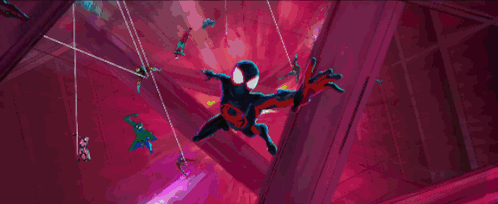

  

<h1 align="center">🕷️ Welcome to the Multiverse 🕸️</h1>

  <i>"Anyone can wear the mask. You could wear the mask."</i> 
  <b>— Miles Morales / Gwen Stacy / Peter Parker</b>

  
  

  

  

  

## 🕸️ Origin Story: The Web-Slinger of Code

Just like Peter Parker getting bitten by a radioactive spider, my journey began with a single line of code that changed everything. My "Spidey Sense" tingles every time a bug enters production, and I've learned that with great computational power comes a great responsibility to build scalable, clean, and optimized architectures. 

I don't just write code; I swing between complex microservices, weaving webs of logic that connect databases, APIs, and beautiful user interfaces. Balancing my life between mastering the arcane arts of Machine Learning and defending the digital city against the forces of chaos (spaghetti code), I'm always looking for the next leap of faith into a new technology.

  

  

  

## ⚡ Current Missions (Webs I'm Spinning)

- 🦸‍♂️ **Mastering Agentic AI & Large Language Models:** Pushing the boundaries of what machines can understand and generate.
- 🕷️ **Full-Stack Web Development:** Crafting pixel-perfect, responsive web applications that feel as smooth as swinging through the skyline of New York.
- 🕸️ **Automating the Spider-Verse:** Designing CI/CD pipelines to catch bad deployments before they ever hit the streets.

  

  

  

## 💥 Villains I've Defeated (Tech Stack)

Every hero needs a utility belt. These are the tools in my web-shooters, mastered to keep the streets safe from chaos:

  
  
  
  
  
  

## 🎭 The Sinister Six (Challenges I Conquered)

- **Doc Ock (Multi-tasking):** Managing complex distributed architectures where every service acts as an independent arm.
- **Venom (Legacy Code):** Taming dark, chaotic, and monolithic codebases, cleansing them into pure, maintainable architectures.
- **Green Goblin (Production Outages):** Defeating unexpected runtime crashes with high-flying debugging skills and tracing tools.
- **Sandman (Data Pipelines):** Wrangling massive, shifting pipelines of unstructured data into organized, actionable insights.

  

--- 🕸️ ---

  

  <h3>🎧 Web-Swinging Soundtrack</h3>
  
<i>Hit play and enjoy the vibe of the Spider-Verse:</i>

  <video controls src="Phillip-Phillips-Gone-Gone-Gone.mp3" width="400"></video>

  

  
<i>"See ya later!"</i>

  

